# Golden Years Tech Help

A production website and internal operations CRM built for a senior-focused technology support business.

[View the public website](https://www.goldenyearsth.com/)

> The production repository is private because the application contains proprietary business workflows, internal tooling, security-sensitive configuration, and systems that process customer information.
>
> This case study documents the architecture and engineering without exposing production source code, credentials, or private business data.

## Overview

Golden Years Tech Help needed more than a marketing website.

Customers needed a straightforward way to request technology assistance, while staff needed a central system for managing intake, scheduling, technician assignments, customer history, communication, billing, payments, and operational records.

I designed and built both the public website and the authenticated CRM that supports that workflow.

I was the sole code contributor to the production repository and handled the majority of the project's technical implementation and infrastructure, including:

- application and workflow design
- public website and CRM development
- website copy
- PostgreSQL schema and migrations
- authentication and Row Level Security
- Supabase Edge Functions
- Google Calendar integration
- Resend email integration
- Stripe CRM integration
- Netlify and Supabase configuration
- DNS and production-domain configuration
- Google Workspace setup required for calendar integration
- production secrets
- testing and CI
- deployment hardening
- production launch testing and maintenance

The business owners supplied the existing brand identity, logo, business accounts, and core business needs. They also provided input on areas such as staff roles and permissions.

The broader operational model was designed by me and refined with the owners through conversation, implementation, testing, and review.

## Technology

| Area | Technology |
| --- | --- |
| Frontend | HTML5, CSS, Vanilla JavaScript |
| Backend | Supabase Edge Functions, TypeScript, Deno |
| Data | PostgreSQL, Supabase RPC, Realtime |
| Authentication | Supabase Auth |
| Authorization | PostgreSQL Row Level Security |
| Integrations | Google Calendar API, Stripe, Resend |
| Hosting | Netlify |
| Tooling | Git, GitHub, GitHub Actions, Supabase CLI, `html-validate` |
| Background Work | PostgreSQL `pg_cron`, `pg_net`, Supabase Vault |

The production system includes **18 core application tables, 46 applied database migrations, 13 deployed Edge Functions, six staff roles, and 28 automated Edge Function tests**.

## Architecture

The browser application is deployed through Netlify while Supabase provides the relational database, authentication, authorization, Realtime updates, RPC functions, and privileged server-side functions.

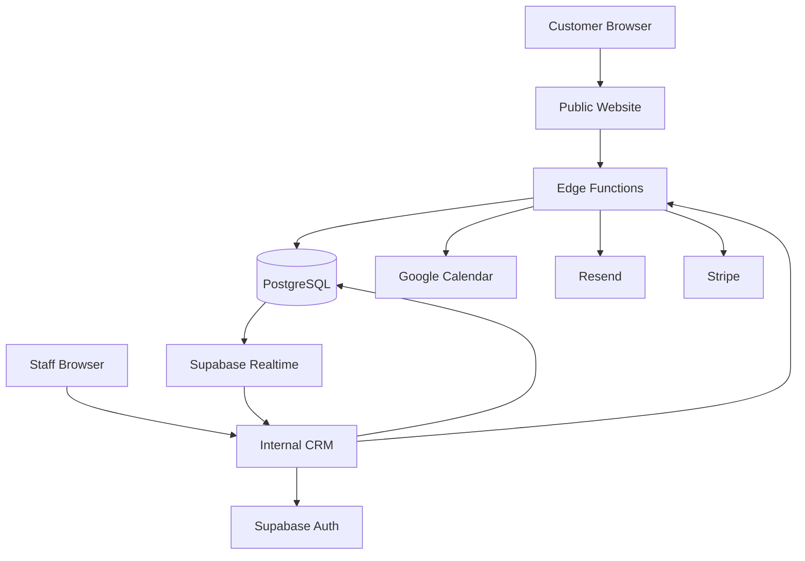

Business logic is divided between the browser, PostgreSQL, and Edge Functions.

The browser handles interface behavior and ordinary application state. PostgreSQL enforces relational workflows, permissions, constraints, and transactional operations. Edge Functions handle privileged workflows and external services so sensitive credentials are not shipped to the client.

## Public Experience

The public site explains Golden Years' services in plain language and gives customers a structured way to request help.

Customers can browse service categories based on common technology problems rather than needing to know technical terminology.

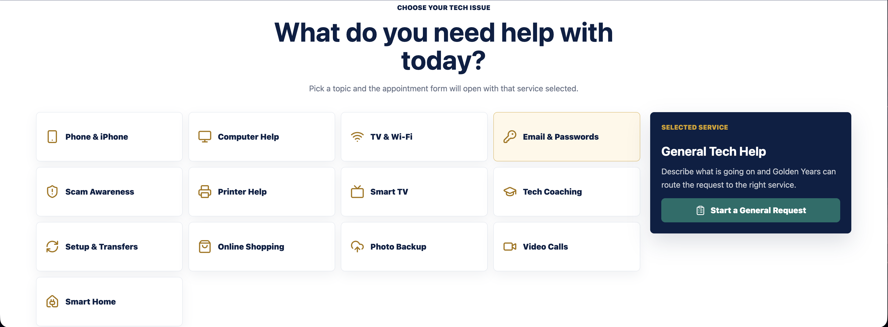

The booking workflow collects:

- contact information
- service and device information
- preferred appointment date and time
- visit type
- who the service is for
- issue description
- contact consent

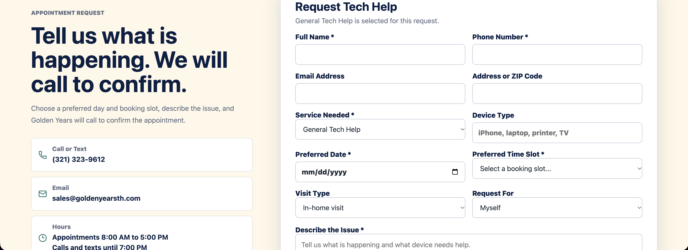

Validation occurs in both the browser and the server-side intake function.

The final stage also includes consent messaging and a human-verification challenge as part of the application's public intake protections.

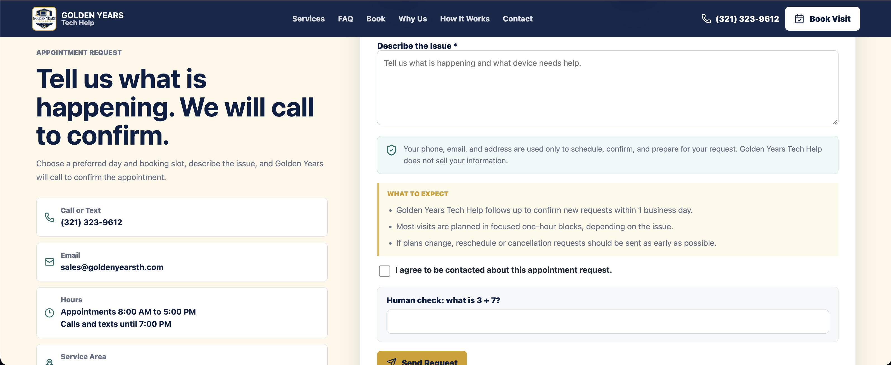

A valid submission creates a lead and linked service ticket, then queues the related calendar and email workflows.

The public site also includes canonical URLs, page-specific metadata, Open Graph data, `robots.txt`, a sitemap, JSON-LD on key pages, responsive layouts, and accessibility-oriented interaction patterns.

## Service + Customer Workflow

The application's data model keeps the initial service request separate from a durable customer profile.

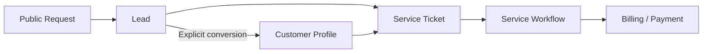

A lead receives a ticket immediately, but customer creation remains an explicit staff action.

This was intentional. Automatically matching people based only on a phone number or email can incorrectly merge unrelated customers who share contact information.

A customer can then retain multiple service tickets over time.

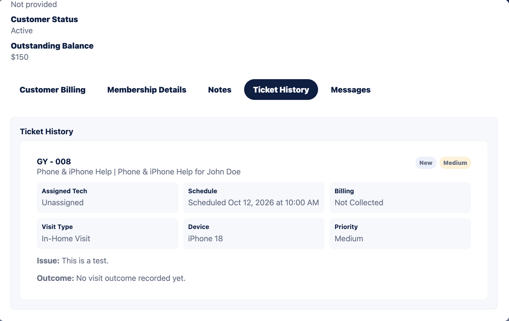

### Lead Management

The CRM allows staff to inspect incoming requests and manage the information needed to move them toward service.

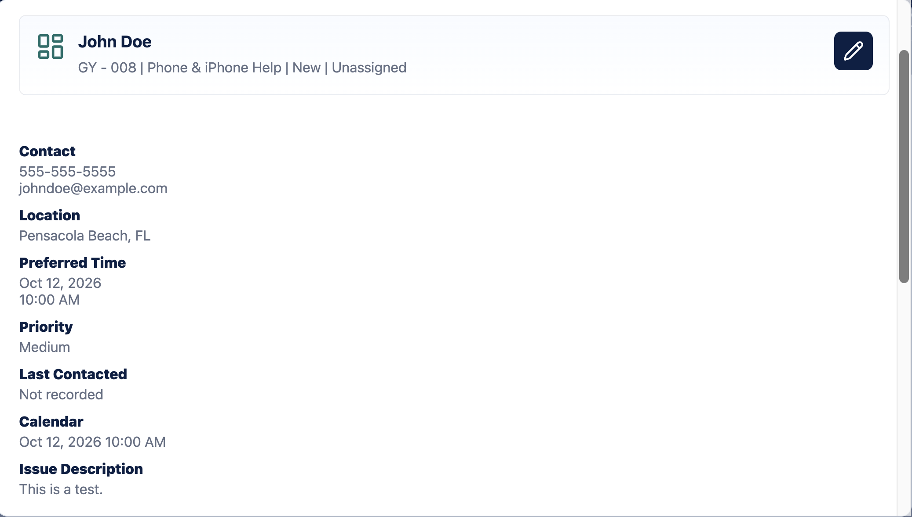

Staff can update status, priority, technician assignment, and operational context.

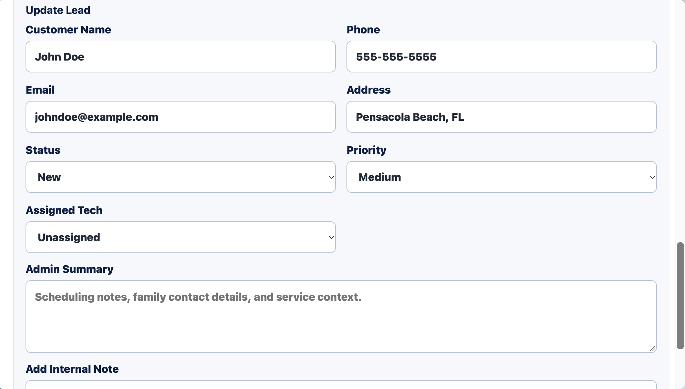

The workflow preserves the relationship between the original lead, its service ticket, scheduling information, and any later customer profile.

### Ticket Management

Service tickets represent the operational case being worked by staff.

Ticket controls manage scheduling, status, payment state, archival state, and visit outcomes.

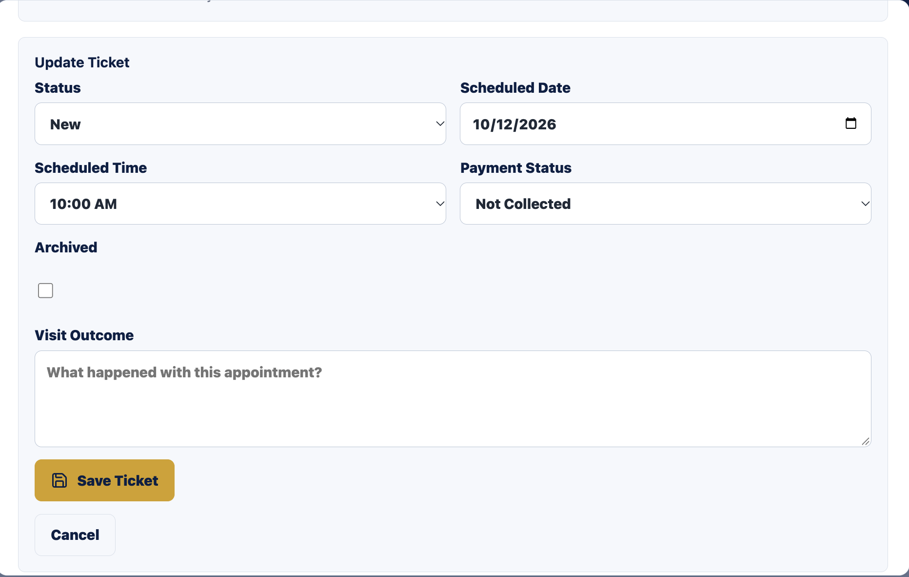

The system distinguishes between a customer's requested appointment time and the confirmed working schedule so staff can coordinate a request before treating it as finalized.

## CRM + Role-Based Access

The CRM provides administrative and technician-specific workspaces.

Administrative functionality includes:

- dashboard and pipeline views
- leads
- customers
- tickets
- staff management
- billing
- audit history
- settings and exports

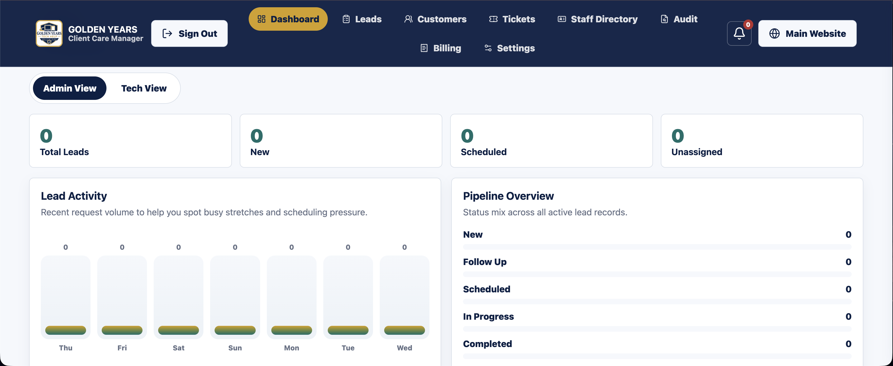

Technicians receive a more limited workspace centered on assigned work, open visits, related customers, payments, and scheduling.

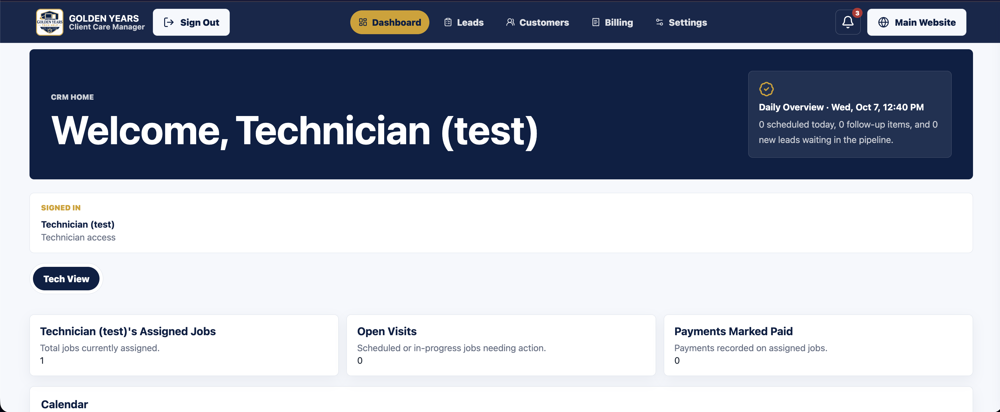

The organizational model supports:

- owner
- administrator
- developer
- regional manager
- territory manager
- technician

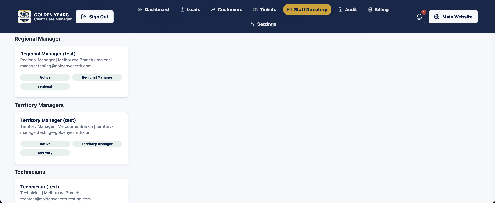

Authentication is handled through Supabase Auth.

Authorization is enforced through PostgreSQL Row Level Security and server-side permission checks rather than relying on hidden navigation or disabled buttons.

Access can depend on role, branch, territory, management relationship, technician assignment, and the record being accessed.

The CRM also manages persisted sessions, expiry handling, session revalidation, logout cleanup, and first-login password-change behavior when configured.

Supabase Realtime subscriptions allow relevant database changes to appear without requiring staff to manually reload the application. Realtime refresh is coordinated with local form state so an incoming update does not blindly overwrite active edits.

## Integrations

### Google Calendar

Scheduling is synchronized around one authoritative company-calendar event for each service case.

The integration supports:

- tentative events
- confirmed scheduling
- cancellations
- technician and manager attendees
- updates to existing events
- stored event references
- retryable background synchronization

When a schedule changes, the application updates the existing event rather than intentionally creating a separate copy for every change.

If immediate synchronization fails, the desired state remains queued for retry.

### Resend

Resend supports both automated and staff-triggered communication.

Implemented workflows include:

- new-request notifications to the business
- customer booking confirmations
- staff email to leads and customers
- threaded replies
- review-request emails
- inbound customer replies recorded in CRM history

Inbound webhook requests are signature-verified.

### Stripe

The CRM implements Stripe Payment Intents using Stripe-hosted Elements.

Card details are entered through Stripe's payment interface and are not stored directly by the Golden Years application.

The workflow includes:

- Payment Intent creation
- approved-amount validation
- payment reservations
- server-side verification
- webhook reconciliation
- payment ledger records
- receipt generation
- CRM balance updates
- refund reconciliation

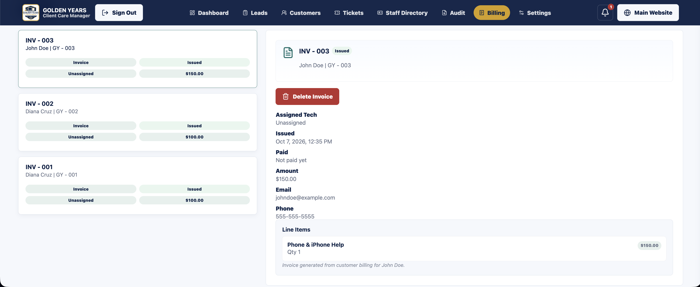

Payment finalization uses transactional database logic so related payment, receipt, balance, and audit updates remain consistent.

## Security + Reliability

Because the CRM processes customer and operational information, security and failure recovery were treated as architectural requirements.

Implemented controls include:

- authenticated staff access
- PostgreSQL Row Level Security
- server-side authorization for privileged operations
- service-role isolation
- server-side integration secrets
- Stripe and Resend webhook signature verification
- server-side input validation and normalization
- abuse and replay protections on public intake
- duplicate-submission controls
- HTML escaping for user-provided content
- spreadsheet formula-injection protection for CSV exports
- restricted calendar embed URLs
- Content Security Policy and other browser security headers
- restrictive CRM indexing and caching behavior
- allow-listed production deployment output

External integrations also use reliability mechanisms including:

- durable background jobs
- retries with backoff
- stale-job recovery
- claim and generation controls
- idempotency
- database transactions
- payment reservations
- webhook reconciliation

For example, a scheduling update can remain saved in the CRM even if Google Calendar is temporarily unavailable. Calendar synchronization can then retry independently.

## Audit History

The CRM maintains operational history for important record and workflow changes.

Audit entries can include the actor, role, action, entity, timestamp, and structured change details.

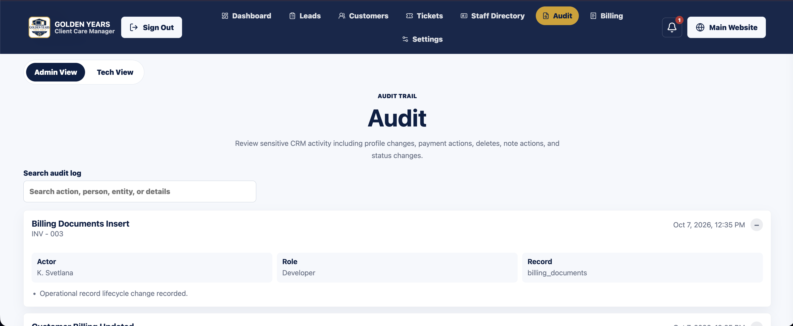

Administrative users can search and inspect this history inside the CRM.

The system is described as operational auditing rather than exhaustive security-event logging.

## Accessibility

Accessibility was especially important for this project because Golden Years primarily serves older adults and people who may be less comfortable with technology.

That audience may also include customers with visual, motor, cognitive, or other disabilities that make inaccessible interfaces especially difficult to use.

Implemented accessibility work includes:

- semantic form labeling
- skip-to-content navigation
- keyboard-accessible interaction
- visible focus states
- modal focus trapping and restoration
- Escape-key handling
- accessible dialog labeling
- `aria-live` regions for dynamic feedback
- accessible inline status and error messaging
- reduced-motion support
- responsive layouts
- straightforward interface language

Accessibility was considered as part of the product design rather than added only after implementation.

The project does not currently claim formal WCAG 2.2 AA conformance. A future goal is to perform a structured WCAG 2.2 Level AA evaluation with automated and manual testing, keyboard review, assistive-technology testing, contrast and reflow evaluation, and remediation where needed.

## Testing + Production Validation

Automated verification includes:

- 28 Deno Edge Function tests
- Edge Function type checking
- PostgreSQL workflow tests
- JavaScript syntax checks
- HTML validation
- build-script verification
- Git whitespace checks
- Supabase database linting
- deployment-output checks

Test coverage includes public booking controls, email-template escaping, staff authorization scope, Calendar synchronization, attendee behavior, idempotency, error handling, and calendar configuration.

The project does not currently have complete automated browser end-to-end coverage.

Before launch, I also performed production smoke testing of the major integrated workflows.

That included:

- signing into the production CRM
- sending a real production email
- modifying the production Google Calendar through the application
- successfully charging my own card through the production Stripe integration

These tests verified the major integrations end-to-end at deployment.

## Deployment

The public site and CRM are hosted through Netlify using a generated `dist/` directory.

The production build publishes an explicit allow list of frontend files rather than exposing the repository itself.

Database migrations and Edge Functions are deployed separately through Supabase.

I configured:

- Netlify
- Supabase
- Resend
- DNS
- production-domain behavior
- Google Workspace requirements for Calendar synchronization
- application-side Stripe configuration
- production secrets

The deployment process intentionally excludes database files, environment configuration, and internal development artifacts from public output.

CI also verifies that sensitive backend artifacts are not accidentally included in the deployable directory.

## Engineering Challenges

### Preserving the Lead-to-Customer Lifecycle

A service request needed to become a trackable case immediately without prematurely treating every requester as a durable customer.

The final design creates the ticket at intake and delays customer-profile creation until explicit conversion.

### Reliable Calendar Synchronization

Database state and an external Calendar API cannot be updated as one atomic transaction.

The solution combines immediate synchronization with stored event references, a durable desired-state queue, retries, worker claims, and idempotency controls.

### Role-Aware Data Access

Owners, managers, and technicians need different views of the same operational system.

The implementation combines role-aware frontend behavior with PostgreSQL RLS and server-side authorization so the UI is not the only access boundary.

### Safe Payment Finalization

A successful card payment affects Stripe and several internal CRM records.

The implementation combines reservations, amount validation, Stripe verification, webhook signatures, idempotency, database locking, and transactional finalization to reduce duplicate or inconsistent payment state.

## Tradeoffs + Future Improvements

The frontend intentionally uses vanilla JavaScript rather than a frontend framework or bundler.

That kept deployment simple, but the CRM's primary JavaScript module became large and now handles state, rendering, authentication, data access, and workflows in one place.

If I were restructuring the frontend today, modularizing those responsibilities would be a priority.

Other future improvements include:

- browser-based end-to-end tests
- expanded RLS and role-mutation testing
- formal WCAG 2.2 AA conformance evaluation
- automated accessibility regression testing
- stronger application observability
- reconciliation tooling for rare integration failures
- scheduling-conflict detection
- additional reporting and workflow automation

## Source Availability

Production source code is intentionally private.

The application contains proprietary business workflows, internal operational functionality, security-sensitive configuration, and integrations with external business services.

Keeping that repository private protects client confidentiality and the production system while this case study provides public technical visibility into the work.