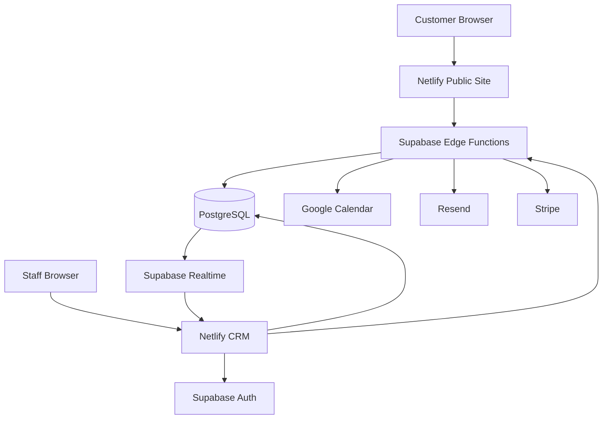
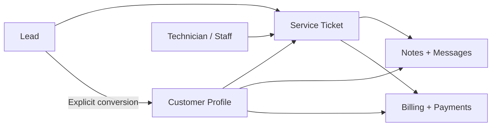
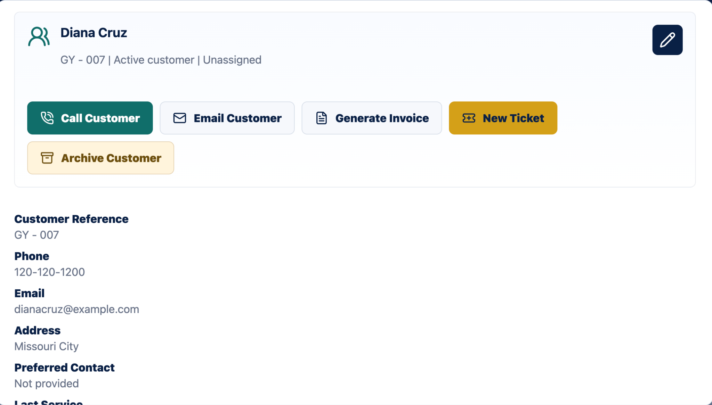
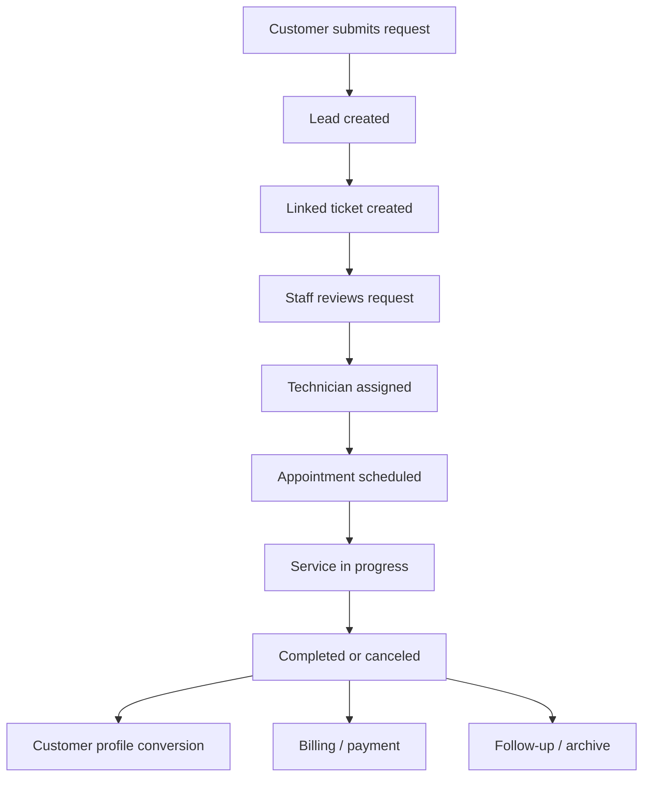
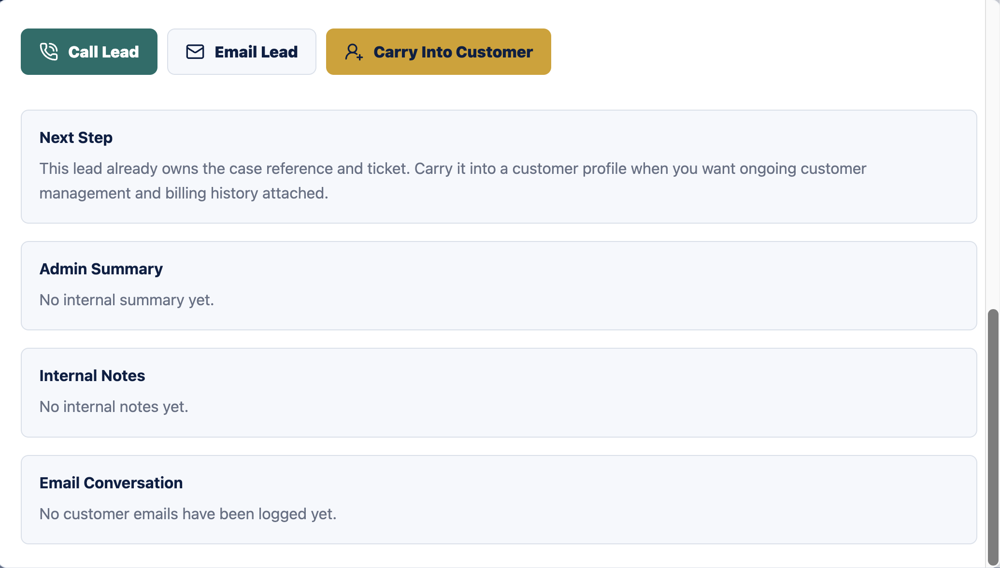
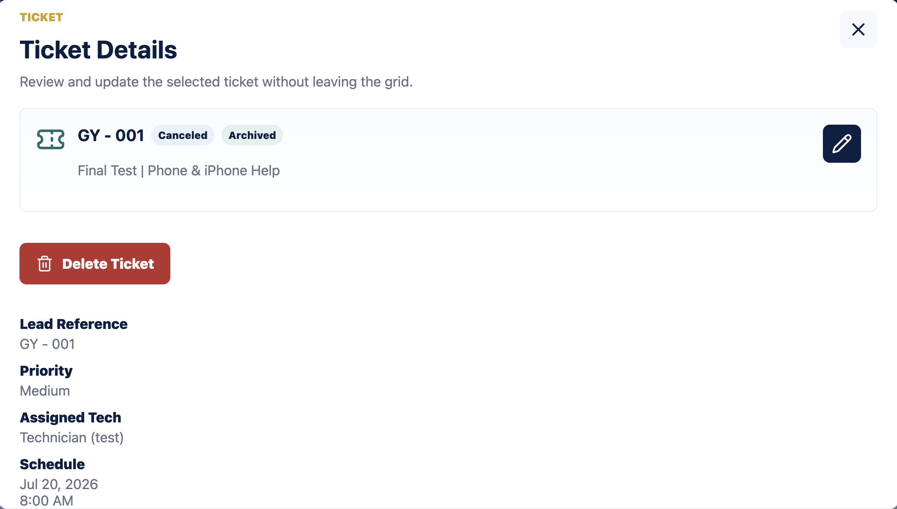
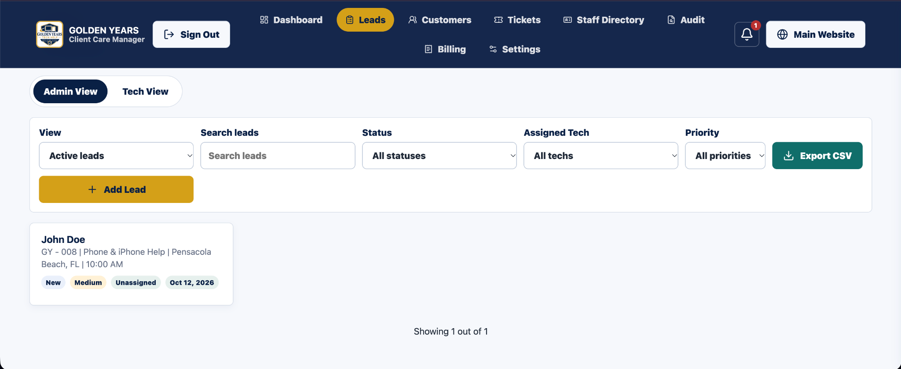

# Golden Years Tech Help

A technical case study documenting the architecture, workflows, integrations, security decisions, and engineering behind a production website and internal CRM built for Golden Years Tech Help.

[View the public website](https://www.goldenyearsth.com/)

> The production source code is intentionally maintained in a private repository because the application contains proprietary business workflows, internal operational tooling, security-sensitive configuration, and systems that process customer information.
>
> This repository documents the system without exposing production source code, credentials, customer data, or private business information.

## Overview

Golden Years Tech Help is a senior-focused technology support business.

I designed and built both the customer-facing website and the authenticated internal CRM used to manage the operational workflow behind incoming service requests.

The application turns a public appointment request into a trackable workflow spanning intake, service tickets, scheduling, technician assignment, customer history, communication, billing, payment processing, calendar synchronization, and audit history.

I was the sole code contributor to the production repository and also handled the majority of the project's technical infrastructure and deployment.

The system was built as a production business application rather than a portfolio demonstration.

## Project Scope

Golden Years contains two primary user-facing surfaces within one production codebase.

### Public Website

A customer-facing website used to:

- discover available services;
- understand how Golden Years works;
- request technology assistance;
- select the type of service needed;
- provide device and issue information;
- choose a preferred appointment date and time;
- provide contact and visit information; and
- submit a structured service request.

The public site also includes production-oriented discoverability work, including page-specific titles and descriptions, canonical URLs, `robots.txt`, a sitemap, Open Graph metadata, and structured JSON-LD on key pages.

Images use explicit dimensions, and non-hero imagery uses lazy loading to support predictable layout and page performance.

*The customer-facing homepage emphasizes plain-language service information, clear navigation, and direct appointment and contact actions.*

#### Service Discovery

Customers can browse service categories before opening the appointment workflow. Selecting a category carries that service choice into the request process.

*Service discovery is organized around common technology problems rather than technical terminology, helping customers identify the type of help they need.*

### Internal CRM

An authenticated operations application used by staff to manage:

- leads;
- customer profiles;
- service tickets;
- technician assignments;
- scheduling;
- service status and outcomes;
- notes;
- customer communication;
- billing;
- card payments;
- invoices and receipts;
- audit history;
- staff access and organizational scope;
- calendars; and
- operational exports.

All CRM screenshots in this case study use fictional, seeded, or sanitized data. No real customer records, private staff information, communications, schedules, payment identifiers, credentials, provider identifiers, or private operational data are published.

## My Role

The business owners approached me with the underlying business need, existing Golden Years branding and logo, and their requirements for how different staff roles should operate.

From there, I designed the general software system and operational workflow.

My responsibilities included:

- gathering requirements directly from the business owners;
- translating business needs into software workflows;
- designing the CRM's operational policies and processes;
- iterating on those workflows with the owners;
- defining practical acceptance criteria through conversation, implementation, and testing;
- writing the public website copy;
- designing and implementing the public website;
- designing and implementing the CRM;
- designing the PostgreSQL schema;
- writing and maintaining database migrations;
- designing Row Level Security policies;
- implementing authentication and role-aware access;
- creating database functions and triggers;
- developing Supabase Edge Functions;
- implementing Google Calendar integration;
- implementing Resend email integration;
- implementing the CRM-side Stripe payment integration;
- configuring Supabase;
- configuring Netlify;
- configuring Resend;
- configuring DNS and production domain behavior;
- configuring the Google Workspace environment required by the Calendar integration;
- configuring production secrets;
- implementing testing and CI verification;
- hardening the deployment process;
- testing the production application before launch; and
- maintaining the software through its recorded release history.

The owners retained responsibility for the business itself and supplied the existing brand identity, Google Workspace account, domain, and Stripe business account.

For Stripe, I was added as a developer and implemented/configured the application's Stripe integration rather than administering every business-level Stripe account setting.

## Requirements + Operational Design

The business owners provided the core business needs and gave input on areas such as staff permissions and organizational roles.

The broader operational model was designed by me and reviewed with the owners throughout development.

That included decisions around:

- the lead-to-customer lifecycle;
- how service tickets should be created and retained;
- staff and technician permissions;
- assignment workflows;
- appointment states;
- scheduling behavior;
- customer history;
- communication tracking;
- billing and payment state;
- audit history;
- record deletion and archival safeguards; and
- the relationship between CRM state and external systems.

Formal written acceptance criteria were not supplied at the beginning of the project.

Instead, acceptance criteria evolved collaboratively through requirements conversations, implementation, client review, testing, and iteration.

A feature was considered ready when the business workflow behaved correctly for the client and its technical dependencies operated as expected.

## Architecture

The system uses a static browser frontend with Supabase providing the primary application backend.

Privileged external-service credentials and sensitive integration logic remain server-side rather than being shipped to the browser.

Business logic is distributed intentionally across:

- browser JavaScript for UI behavior and ordinary application state;
- PostgreSQL for transactional workflows, constraints, access rules, and data integrity; and
- Edge Functions for privileged operations and external API integration.

## Technology

### Frontend

- HTML5
- CSS
- Vanilla JavaScript
- Responsive interface design
- Accessible interaction patterns

### Backend + Data

- PostgreSQL
- Supabase
- Supabase Auth
- Row Level Security
- Supabase Realtime
- Supabase RPC
- Supabase Edge Functions
- TypeScript
- Deno

### Integrations

- Google Calendar API
- Stripe.js
- Stripe Payment Intents
- Stripe webhooks
- Resend
- Resend webhooks

### Infrastructure + Tooling

- Netlify
- Git
- GitHub
- GitHub Actions
- Supabase CLI
- Node.js for development and CI tooling
- `html-validate`
- PostgreSQL `pg_cron`
- PostgreSQL `pg_net`
- Supabase Vault
- automated Deno testing

## By the Numbers

The production codebase includes:

- 10 public HTML pages
- 8 administrator CRM modules
- 5 technician CRM modules
- 18 core application tables
- 46 database migrations
- 13 deployed Edge Functions
- 6 staff roles
- 6 lead/ticket workflow statuses
- 15 public service categories
- 28 automated Edge Function tests

These figures describe the technical scope of the application rather than business performance metrics.

## Public Booking Workflow

The public site allows customers to submit structured appointment requests including:

- name;
- phone;
- optional email;
- optional address and ZIP;
- selected service;
- optional device information;
- preferred date;
- preferred half-hour time;
- visit type;
- who the appointment is for;
- issue description; and
- contact consent.

Validation occurs both in the browser and server-side.

### Appointment Request Interface

*The public request form collects structured contact, service, device, scheduling, visit, and issue information while keeping the workflow readable and straightforward.*

The final stage of the request also includes contact consent, a short explanation of what happens next, and a human-verification challenge used as part of the public intake protections.

*Consent and human-verification controls are integrated directly into the booking workflow rather than handled as separate administrative steps.*

After a valid submission:

1. the request is persisted as a lead;
2. a linked service ticket is created;
3. a tentative calendar operation is queued;
4. business notification email is queued;
5. customer confirmation email is queued when an email address is supplied; and
6. staff can begin the internal service workflow.

Downstream integrations use durable background processing so temporary external-service failures do not cause the original customer request to disappear.

## Data Model

The application models the service lifecycle as related business entities rather than storing each booking as an isolated form submission.

A lead receives a linked service ticket immediately.

Creation of a durable customer profile remains an explicit staff operation.

One customer may have multiple tickets over time.

### Customer Records + Service History

*Customer profiles centralize contact actions, billing, ticket creation, archival controls, and long-term account information.*

A customer can retain multiple service cases over time rather than losing prior visits when a new request is created.

*Ticket history preserves scheduling, assignment, billing state, visit type, device information, priority, issue context, and service outcomes across customer interactions.*

This separation prevents the application from silently treating people as the same customer merely because they share a phone number or email address.

## Service Workflow

A simplified service lifecycle looks like:

### Lead Intake + Case Detail

A submitted request becomes a lead with its own case reference and scheduling context.

*Lead details preserve the original contact information, service request, preferred appointment time, priority, calendar state, and issue description.*

Staff can then update the operational fields used to move the request through the service process.

*Administrative controls allow staff to update status, priority, technician assignment, and internal service context.*

The same lead record also provides communication and conversion actions while preserving internal notes and customer communication history.

*Lead actions connect contact, email, internal notes, and explicit customer conversion to the same service case.*

### Ticket Management

Service tickets represent the operational case being worked after intake and remain linked to the originating service request.

*Ticket records preserve case status, technician assignment, scheduling information, priority, and historical state.*

Staff can update scheduling, workflow status, payment state, archival state, and visit outcome directly from the ticket workflow.

*Ticket controls connect scheduling and service progress with billing state and recorded visit outcomes.*

The system intentionally distinguishes between:

- a customer's preferred appointment time;
- tentative scheduling;
- technician assignment; and
- a confirmed working schedule.

That distinction allows staff to review and coordinate a request before treating it as a confirmed appointment.

## CRM Workspaces

The CRM provides different workspaces according to staff role.

Administrative functionality includes:

- Dashboard
- Leads
- Customers
- Tickets
- Staff
- Audit
- Billing
- Settings and Exports

Technician functionality includes:

- Dashboard
- Leads
- Customers
- Billing
- Settings

### Administrator Dashboard

*The administrator dashboard provides a centralized view of lead volume, scheduling state, assignment needs, recent activity, and pipeline status.*

### Lead Management

*The lead workspace supports filtering by status, technician assignment, priority, active/archive state, and text search, along with CSV export and manual lead creation.*

Data visibility is determined by role and organizational scope rather than by simply hiding navigation links.

### Technician Workspace

*Technicians receive a narrower operational workspace centered on their assigned work, open visits, payments, customer records, and scheduling rather than full-company administration.*

## Realtime CRM Updates

The CRM uses Supabase Realtime subscriptions to respond to relevant PostgreSQL changes without requiring staff to manually refresh the application.

Realtime behavior is coordinated with local editing state so incoming updates do not blindly overwrite a form while a staff member is actively working.

This allows the internal application to stay responsive to changes made elsewhere while protecting in-progress user input.

## Operational Utilities

The CRM also includes supporting tools for day-to-day business operations.

These include:

- searchable and filterable lead, customer, ticket, staff, billing, and audit views;
- staff notifications tied to relevant records;
- company and technician calendar views;
- configurable technician calendar embeds;
- customer and lead communication history;
- lead, staff-directory, technician-performance, and individual-staff CSV exports; and
- protections against spreadsheet formula injection in exported CSV data.

These utilities were designed to reduce the amount of operational information staff need to manage outside the CRM.

## Authentication + Authorization

Staff authentication is handled through Supabase Auth.

The CRM also manages session lifecycle behavior, including persisted browser sessions, automatic token refresh, expiry checks, revalidation when the application regains focus or visibility, and application-state cleanup during logout.

The system also supports requiring a password change on first login when an account is configured that way.

The application supports roles including:

- owner;
- administrator;
- developer;
- regional manager;
- territory manager; and
- technician.

Authorization combines PostgreSQL Row Level Security with server-side permission checks.

Access can depend on:

- staff role;
- branch;
- territory;
- management relationship;
- technician assignment;
- record relationship; and
- notification recipient.

Privileged internal-control tables and sensitive workflows remain inaccessible to ordinary browser roles.

### Organizational Roles

*The staff directory reflects the application's organizational model across regional managers, territory managers, and technicians, with role and scope information represented directly in the CRM.*

The frontend reflects permissions for usability, but frontend visibility is not treated as the security boundary.

## Security + Data Protection

Because the CRM processes customer and operational information, security controls were treated as architectural requirements rather than simply interface features.

Implemented safeguards include:

- authenticated staff access through Supabase Auth;
- role- and assignment-aware PostgreSQL Row Level Security;
- server-side authorization checks for privileged workflows;
- separation of public and internal application functionality;
- service-role isolation for privileged database operations;
- server-side storage and use of integration secrets;
- webhook-signature verification for external services;
- server-side validation and normalization of public submissions;
- layered abuse, replay, and duplicate-submission controls;
- HTML escaping for user-provided content;
- spreadsheet formula-injection mitigation for CSV exports;
- validated external calendar embed URLs;
- production Content Security Policy and browser security headers;
- CRM `noindex` and restrictive caching behavior; and
- hardened deployment output that publishes only approved public assets.

Payment-card details are entered through Stripe-hosted components and are not stored directly by the application.

The architecture uses defense-in-depth rather than assuming that hidden buttons or private-looking URLs are sufficient authorization controls.

This case study intentionally describes security architecture at a high level and does not publish credentials, private infrastructure identifiers, sensitive policy details, internal routing information, or other information that would unnecessarily increase attack surface.

## Google Calendar Integration

Scheduling is synchronized around one authoritative company-calendar event per service case.

The integration supports:

- tentative scheduling;
- confirmed scheduling;
- cancellation;
- technician attendee synchronization;
- manager attendee synchronization;
- stored event references;
- CRM/calendar reconciliation; and
- retryable background synchronization.

When a record changes, the existing event can be patched instead of creating unrelated calendar copies.

Stored event references and idempotency behavior help prevent duplicate event creation.

If immediate synchronization fails, the desired state remains in a durable integration queue and can be retried asynchronously.

## Email Workflows

Resend provides outbound and inbound email workflows.

Implemented flows include:

- automatic business notification for a new service request;
- automatic customer confirmation when an email is supplied;
- staff-triggered email to leads and customers;
- threaded replies;
- review-request emails; and
- inbound customer replies routed back into CRM history.

Inbound webhook requests are signature-verified.

Messages are associated with the relevant service/customer record so communication can remain part of the operational history.

## Stripe + Payments

The CRM implements Stripe Payment Intents using Stripe Elements.

Card details are handled through Stripe-hosted payment components and are not stored directly by the Golden Years application.

The workflow includes:

- payment-intent creation;
- approved-amount validation;
- payment reservations;
- Stripe-side confirmation;
- server-side payment verification;
- webhook reconciliation;
- local payment ledger records;
- receipt generation;
- CRM balance updates; and
- refund reconciliation.

### Billing Records

*The billing workspace connects invoices and receipts to CRM records while preserving payment status, service line items, customer context, and document history.*

The case study uses fictional customer and payment information. Card-entry screens and external Stripe identifiers are intentionally not published.

Payment finalization uses transactional database logic so related ledger, receipt, balance, and audit updates are committed together.

Refund initiation remains outside the CRM and is reconciled back into the application through Stripe webhooks.

## Production Validation

Before launch, I performed real production smoke testing of the major integrated workflows.

That testing included:

- successfully signing into the production CRM;
- sending a real email through the production email workflow;
- modifying the production Google Calendar through the application workflow; and
- successfully charging my own card through the production Stripe integration.

These tests were performed as part of deployment validation.

They establish that the major integrations functioned end-to-end in production at launch; they are not intended as a claim that every external service has been continuously monitored or independently revalidated since deployment.

## Audit History

The CRM maintains operational audit history for important records and actions.

Audit entries can record:

- timestamp;
- actor;
- role;
- action type;
- entity type;
- entity identifier;
- entity label; and
- structured change details.

*Administrative users can search and inspect operational history for actions such as record changes, billing activity, deletions, notes, and status updates.*

The screenshot above uses test data. Production audit records are not included in this public case study.

The system is intentionally described as operational auditing rather than exhaustive security-event logging.

## Reliability + Integration Recovery

External systems can fail independently of the CRM.

The application includes reliability mechanisms such as:

- durable integration jobs;
- exponential retries;
- stale-job recovery;
- worker claim tokens;
- generation/version checks;
- idempotency controls;
- transactional database operations;
- payment reservations; and
- webhook reconciliation.

For example, an appointment update can remain safely stored in the CRM even when Google Calendar is temporarily unavailable.

Calendar synchronization can then retry separately rather than requiring staff to reconstruct the appointment manually.

## Accessibility

Accessibility was a core product consideration because Golden Years primarily serves older adults and people who may be less comfortable using technology.

That audience may also include people with visual, motor, cognitive, or other disabilities that can make poorly designed digital interfaces particularly difficult to use.

Implemented accessibility features include:

- semantic form labels and structure;
- skip-to-content navigation;
- keyboard-accessible interactions;
- visible keyboard focus states;
- focus trapping in modal dialogs;
- focus restoration after dialogs close;
- Escape-key handling for modal interfaces;
- explicit accessible dialog labeling;
- `aria-live` regions for dynamic status and result updates;
- accessible inline form and operation feedback;
- reduced-motion support;
- responsive layouts across desktop, tablet, and mobile sizes; and
- clear, straightforward form and interface language.

The goal was not simply to add accessibility attributes after development.

The interface was designed to reduce friction for customers who may already find technology intimidating, unfamiliar, or physically difficult to navigate.

### Future Accessibility Evaluation

Accessibility has been incorporated throughout the application, but the project has not yet undergone a formal WCAG conformance evaluation.

A future goal is to complete a structured **WCAG 2.2 Level AA conformance evaluation**, including:

- automated accessibility testing;
- keyboard-only testing;
- screen-reader and assistive-technology review;
- color and contrast evaluation;
- zoom and reflow testing;
- form/error/status-message review;
- manual evaluation of applicable WCAG success criteria; and
- remediation of any issues identified.

The project does not currently claim formal WCAG 2.2 AA conformance.

## Responsive Design

The application includes dedicated layouts and behavior for desktop, tablet, and mobile devices.

Responsive work includes:

- adaptive navigation;
- stacked content layouts;
- responsive CRM panels;
- mobile-friendly forms;
- constrained modal behavior;
- schedule and dashboard adaptation; and
- reduced-motion overrides.

## Testing + Continuous Verification

The repository contains automated verification across server functions, database workflows, frontend source, and deployment output.

Current coverage includes:

- 28 Deno Edge Function tests;
- Edge Function type checking;
- PostgreSQL workflow tests;
- JavaScript syntax checks;
- HTML validation;
- shell/build-script verification;
- Git whitespace checking;
- Supabase database linting; and
- deploy-output safety checks.

Tested server behavior includes:

- booking challenges;
- public email-template escaping;
- staff scope and authorization;
- calendar attendee behavior;
- calendar synchronization;
- idempotency;
- error handling;
- calendar state recording; and
- calendar embed validation.

The project does not currently claim complete browser-based end-to-end automated test coverage.

High-value future testing work would include automated browser flows for public booking and role-specific CRM workflows.

## Deployment

The public website and authenticated CRM are deployed together through Netlify from a generated `dist/` directory rather than by exposing the project repository directly.

The build process creates that deployment output from an explicit allow list of approved frontend files and assets.

Database migrations and Supabase Edge Functions are deployed separately from the static frontend.

Production configuration includes:

- Netlify hosting and build configuration;
- Supabase database migrations;
- Supabase Edge Functions;
- production environment configuration;
- Google Calendar integration;
- Resend integration;
- Stripe integration;
- DNS configuration; and
- production domain behavior.

I configured the Netlify deployment, Supabase environment, Resend, DNS, production domain integration, Google Workspace requirements for Calendar synchronization, application-side Stripe integration, and production secrets.

This separation keeps frontend deployment, database changes, privileged server functions, and external-service configuration behind distinct production boundaries.

## Deployment Hardening

Because the production repository contains both public frontend assets and backend/database infrastructure, the repository root is not treated as deployable content.

The build process:

- creates a dedicated distribution directory;
- copies only explicitly approved public assets;
- excludes database and configuration artifacts;
- excludes environment and internal tooling files;
- verifies deployment output in CI; and
- applies production security headers.

This creates a deliberate boundary between source code and files that may be publicly served.

## Engineering Challenges

### Preserving One Case Across the Lead + Customer Lifecycle

A service request needs to exist before the requester necessarily becomes a long-term customer.

The final model creates a service ticket with the incoming lead immediately but delays customer-profile creation until an explicit conversion.

This preserves the original service-case history while avoiding automatic customer matching based on potentially ambiguous shared contact information.

### Reliable Calendar Synchronization

A database change and a Calendar API request cannot be treated as one atomic transaction.

The application therefore combines:

- immediate synchronization;
- stored external event references;
- a durable desired-state queue;
- worker claims;
- generation tracking;
- retries; and
- idempotency behavior.

This allows external synchronization to recover without discarding the CRM change that triggered it.

### Organizational Access Control

The CRM must expose different records to owners, administrators, managers, and technicians.

The implementation combines frontend role-aware interfaces with PostgreSQL Row Level Security and server-side access validation.

This ensures the interface does not become the sole authorization boundary.

### Safe Payment Finalization

Payment touches both Stripe and multiple internal business records.

The implementation combines:

- payment reservations;
- approved-amount matching;
- Stripe Payment Intent metadata;
- idempotency;
- webhook verification;
- database locking;
- ledger uniqueness; and
- transactional finalization.

This reduces the risk of duplicate payment handling or inconsistent CRM records.

### Reliable Public Intake

A public booking form cannot safely behave like an unrestricted database insert.

The intake path includes:

- server-side validation;
- normalization;
- consent capture;
- replay protection;
- abuse controls;
- throttling;
- duplicate suppression; and
- durable downstream email/calendar jobs.

### Safe Static Deployment

The application repository contains files that should never be publicly hosted.

The deployment process therefore uses explicit public-file allow-listing and CI verification rather than publishing the source repository directly.

## Technical Tradeoffs

The frontend intentionally uses vanilla JavaScript without a frontend framework or build pipeline.

That reduces deployment complexity and keeps the browser application lightweight.

The tradeoff is that the CRM's primary JavaScript module has grown substantially and now combines:

- shared application state;
- rendering;
- authentication;
- data access;
- event handling; and
- workflow logic.

If I were restructuring the frontend today, modularizing those responsibilities would be one of my first architectural improvements.

Other current tradeoffs include:

- technician lead permissions are primarily row-scoped rather than field-scoped;
- staff-email delivery and message logging can experience a rare partial failure;
- there is no formal scheduling-conflict engine;
- browser-based end-to-end automation has not yet been added; and
- application observability relies primarily on platform/function logs and database job errors rather than a dedicated monitoring service.

These limitations are useful future engineering targets rather than hidden weaknesses.

## Future Improvements

High-value future improvements include:

- modularizing the CRM frontend;
- automated browser end-to-end testing;
- expanded role and RLS mutation testing;
- structured WCAG 2.2 AA conformance evaluation;
- automated accessibility regression testing;
- additional external-service integration tests;
- dedicated application observability;
- reconciliation tooling for rare partial integration failures;
- additional scheduling-conflict detection;
- expanded administrative reporting; and
- additional workflow automation.

## Source Availability

Production source code is intentionally private.

The application contains proprietary business workflows, customer-facing systems, internal operational functionality, security-sensitive configuration, and integrations with external business services.

Keeping the production repository private is a deliberate client-confidentiality and security decision.

This case study exists to provide technical visibility into the system without exposing information that should remain private.